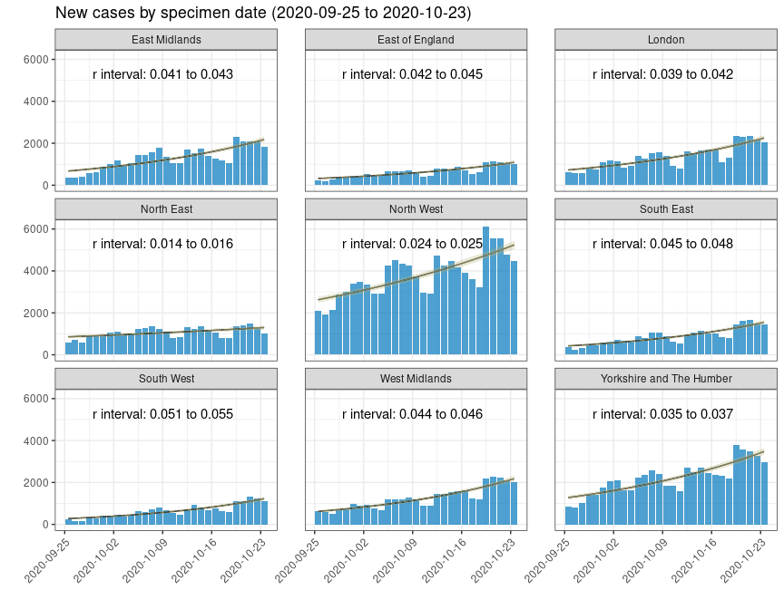

England Covid Example
================

# Cases in the last 6 weeks

``` r
library(ukcovid19)   # Provides daily updates on UK coronavirus cases
library(tidyverse)   # for data manipulation
library(incidence2)  # for generating the epicurves
library(i2extras)    # for fitting a model to the epicurve
```

``` r
# We can use Public Health England's API to get recent regional data
# Don't worry too much about how this is working.
query_filters <- c('areaType=region')
cases_and_deaths = list(
    date = "date",
    areaName = "areaName",
    newCasesBySpecimenDate = "newCasesBySpecimenDate"
)
raw_dat <- get_data(filters = query_filters, structure = cases_and_deaths)

# clean the column names using linelist package

# build the epicurve for the last 6 weeks using incidence2
first_date <- Sys.Date() - 42
last_date <- Sys.Date() - 14

dat <-
    raw_dat %>%
    rename(area_name = "areaName", cases = "newCasesBySpecimenDate") %>%
    filter(date >= first_date, date <= last_date) %>%
    incidence(date, groups = area_name, count = cases)

# fit a poisson model to the dat
fitted_dat <- fit_curve(dat)

# calculate the growth rates
growth_rates <- growth_rate(fitted_dat)
#> Note: incidence2_fit class dropped in returned object

growth_labels <- data.frame(
    area_name = growth_rates$area_name,
    label = sprintf(
        "r interval: %.3f to %.3f", growth_rates$r_lower, growth_rates$r_upper
    )
)


# generate plot
title <- sprintf("New cases by specimen date (%s to %s)", first_date, last_date)
plot(fitted_dat, pi = TRUE, angle = 45, n_breaks = 4) +
    labs(title = title, x = "", y = "") +
    geom_text(
        x = mean(dat$date),
        y = 5300,
        aes(label = label),
        data = growth_labels
    )
```


